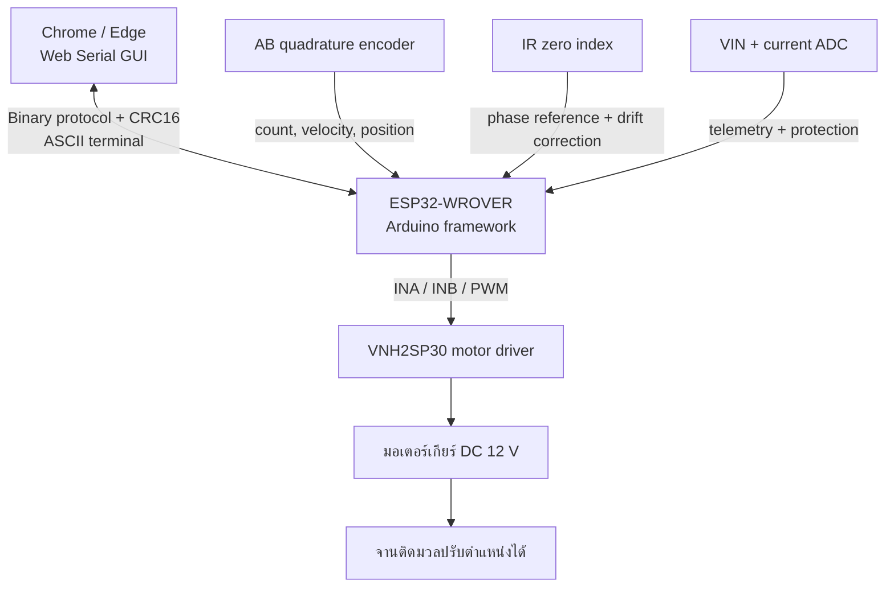
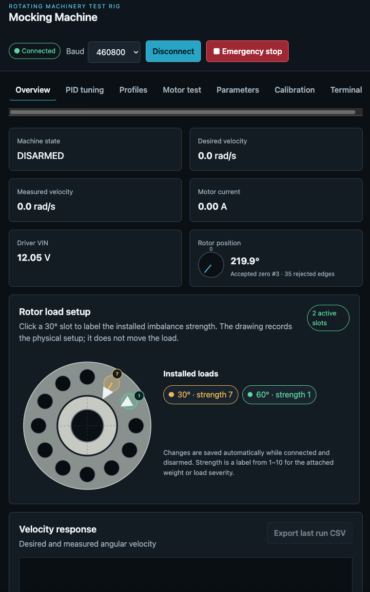
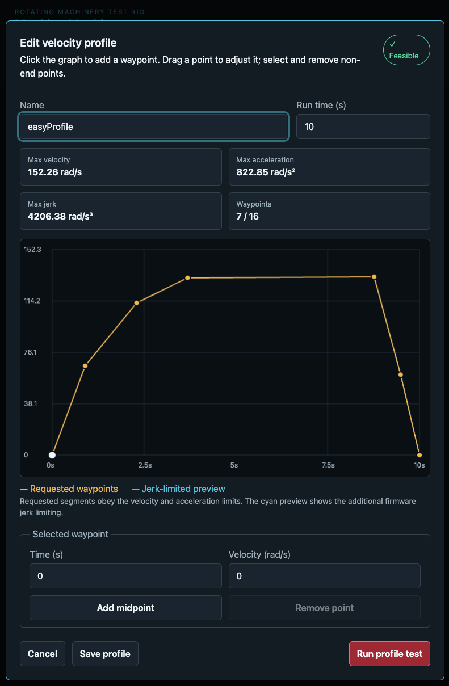
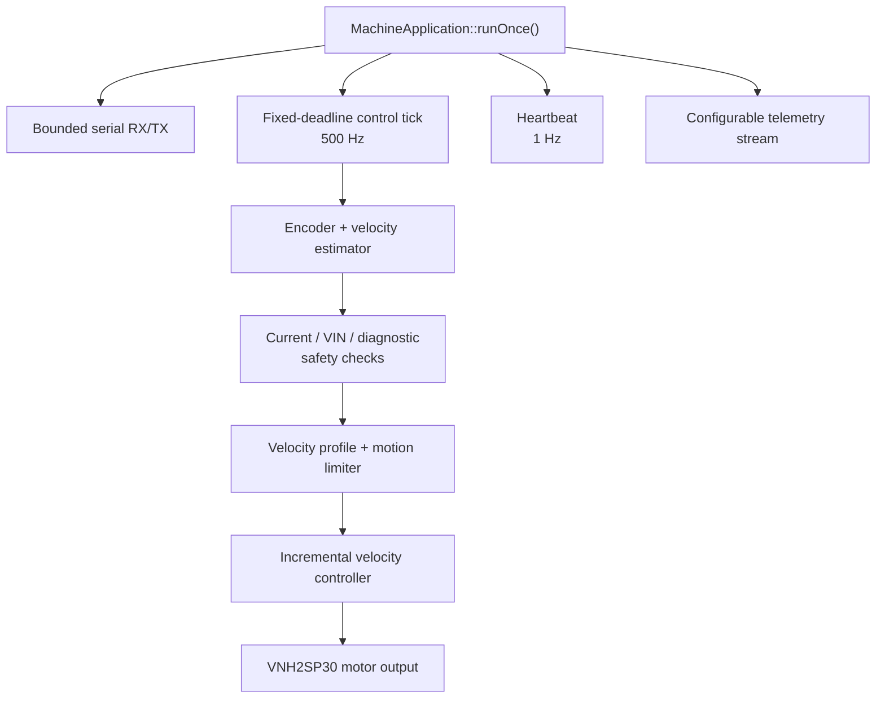

# Mocking Machine

แท่นทดลองจำลองความผิดปกติของเครื่องจักรหมุน เพื่อสร้างชุดข้อมูลที่มีป้ายกำกับสำหรับงานตรวจจับความผิดปกติ เช่น มวลไม่สมดุล (unbalance), ความเสียหายของตลับลูกปืน และการวิเคราะห์ตำแหน่งเฟสของโรเตอร์

ระบบนี้ประกอบด้วยเฟิร์มแวร์บน ESP32-WROVER และ Web Serial GUI สำหรับควบคุมมอเตอร์ สร้างโปรไฟล์ความเร็ว ปรับจูนตัวควบคุม สอบเทียบเซนเซอร์ และบันทึกข้อมูลเป็น CSV โดยออกแบบให้การเชื่อมต่อ GUI หรือการเปิด datastream **ไม่ทำให้มอเตอร์เริ่มหมุนเอง**

> [!WARNING]
> โครงการนี้เป็นเครื่องต้นแบบสำหรับงานวิจัยและทดสอบ ไม่ใช่เครื่องจักรอุตสาหกรรมที่ผ่านการรับรอง จานหมุนที่ติดมวลไม่สมดุลมีพลังงานและแรงสั่นสะเทือนสูง ต้องมีฝาครอบนิรภัย ฐานยึดที่แข็งแรง ฟิวส์ ปุ่มหยุดฉุกเฉิน และสวิตช์ตัดกำลังซึ่งทำงานแยกจากซอฟต์แวร์

## ภาพรวมระบบ



ตัวนับ encoder เป็นแหล่งข้อมูลหลักของตำแหน่งโรเตอร์ ส่วนสัญญาณ zero index ใช้สร้างจุดอ้างอิงครั้งแรกและค่อย ๆ แก้ความคลาดเคลื่อนสะสมเท่านั้น จึงไม่ทำให้ตำแหน่งกระโดดตาม jitter ของเซนเซอร์

### สถานะ implementation ปัจจุบัน

| รายการ | ค่าในเฟิร์มแวร์ปัจจุบัน |
|---|---|
| Wire protocol / settings schema | Version 1 / schema 20 |
| Control loop | ค่าเริ่มต้น 2,000 µs หรือ 500 Hz |
| UART / telemetry | ค่าเริ่มต้น 115200 bit/s / 50 Hz |
| Encoder CPR | ค่าเริ่มต้น 184 counts/rev เป็น placeholder; ต้องสอบเทียบกับเครื่องจริง |
| Current-sense protection | ปิดเป็นค่าเริ่มต้น; telemetry และ calibration ยังทำงาน |
| EN/DIAG protection | ปิดเป็นค่าเริ่มต้นและสามารถปล่อยขาไว้ไม่ต่อได้ |

## ฮาร์ดแวร์หลัก

| อุปกรณ์ | หน้าที่ |
|---|---|
| ESP32-WROVER | รัน control loop 500 Hz, safety state machine และ serial protocol |
| มอเตอร์เกียร์ DC 12 V, 1590 rpm พร้อม AB encoder | ต้นกำลังและ feedback ความเร็ว/ตำแหน่ง |
| VNH2SP30 Single Monster Motor Driver | ขับมอเตอร์ด้วย PWM พร้อม CS และ EN/DIAG แบบเลือกใช้งาน |
| เซนเซอร์อินฟราเรด | ตรวจตำแหน่งศูนย์ของโรเตอร์ด้วย rising-edge interrupt |
| ตัวแบ่งแรงดัน 6.8 kΩ / 1 kΩ | วัดแรงดัน VIN ของ motor driver ที่ GPIO36 |
| จานโรเตอร์ 12 ตำแหน่ง | ติดตั้งมวลไม่สมดุลที่ระยะ 30° และกำหนด strength 1–10 |

ผังขา ค่าแรงดัน วงจรป้องกันระดับสัญญาณ และลำดับ commissioning อยู่ใน [คู่มือการต่อสาย](docs/wiring.md) ควรอ่านก่อนจ่ายกำลังให้มอเตอร์

## ความสามารถหลัก

- ควบคุมความเร็วด้วย incremental PID ที่คำนวณตามเวลาจริง พร้อม anti-windup
- จำกัดความเร็ว ความเร่ง และ jerk ก่อนส่ง setpoint เข้าตัวควบคุม
- สร้างโปรไฟล์แบบ ramp, sine ทิศทางเดียว และ waypoint สูงสุด 16 จุด
- แก้ไขและทดลองโปรไฟล์จากกราฟ โดยตรวจข้อจำกัดของเครื่องก่อนสั่งรัน
- ทดสอบ step response, velocity tracking และองค์ประกอบ P/I/D/total output
- Characterize มอเตอร์ทั้งสองทิศทางเพื่อวัด deadband, ความเร็วสูงสุด, ความเร่ง และ jerk
- สอบเทียบ encoder CPR ด้วยการหมุนเพลาด้วยมือ 1–10 รอบ
- สอบเทียบ VIN และ current sense แบบสองจุดผ่าน GUI
- ตั้งป้ายกำกับตำแหน่งและระดับมวลบนจานโรเตอร์ เพื่อส่งไปพร้อมข้อมูลทดลอง
- บันทึกข้อมูลเฉพาะช่วงที่สั่ง Run และ export เป็น CSV พร้อมไฟล์ load metadata
- จัดเก็บค่าตั้งแบบมี schema และ CRC ใน ESP32 Preferences
- ใช้ binary protocol ที่มี message ID, sequence, payload length และ CRC16/CCITT-FALSE
- มี ASCII terminal สำหรับ commissioning และ debug ผ่านพอร์ตเดียวกับการอัปโหลด

ระบบ current-sense protection และ EN/DIAG ถูกปิดเป็นค่าเริ่มต้น เพื่อลด false fault เมื่อวงจรยังไม่ได้ต่อหรือสอบเทียบ ทั้งสองช่องยังสามารถเปิดใช้งานภายหลังจากหน้า Parameters ได้

## Web Serial GUI

GUI ไม่ต้องติดตั้ง dependency เพิ่ม ใช้งานผ่าน Chrome หรือ Edge บน desktop และรองรับ keyboard/pointer ประกอบด้วยหน้า:

- **แถบสถานะด้านบน** — badge สองแถวแสดงอัตรา RX/TX, telemetry rate และ dropout; คลิกเพื่อดูรายละเอียด frame rate, message rate, อายุข้อมูล และ CRC/framing error
- **Overview** — สถานะเครื่อง telemetry ตำแหน่งโรเตอร์ การตั้งมวล และกราฟความเร็ว
- **PID tuning** — ทดสอบ profile/manual step, velocity tracking และ estimated step response
- **Profiles** — สร้าง แก้ไข ตรวจ feasibility เลือก default และทดลองโปรไฟล์
- **Motor test** — ทดสอบทิศทางและ raw PWM ภายใต้ safety state machine
- **Parameters** — อ่านและแก้ค่าที่มาจากเฟิร์มแวร์ พร้อม export/import parameter CSV ผ่านหน้าตรวจสอบก่อนบันทึก
- **Calibration** — สอบเทียบ encoder, VIN, current sense และ characterize มอเตอร์
- **Terminal** — ส่งคำสั่ง ASCII และดูข้อความ debug





<!-- ภาพที่ควรเพิ่มภายหลัง: PID tuning, calibration และ motor characterization result -->

## โครงสร้างซอฟต์แวร์

เฟิร์มแวร์แยกหน้าที่เป็นโมดูล โดย `MachineApplication` ทำหน้าที่เป็น composition root และเจ้าของ run loop เท่านั้น เส้นทางควบคุม 500 Hz ไม่มี dynamic allocation, ไม่เขียน Preferences และไม่ส่ง serial แบบ blocking



รายละเอียดการออกแบบอยู่ใน [Product and firmware architecture](docs/architecture.md)

## การเตรียมเครื่องมือ

ต้องมี:

- [PlatformIO](https://platformio.org/) สำหรับ build, test และ upload เฟิร์มแวร์
- Chrome หรือ Edge ที่รองรับ Web Serial
- Python 3 หรือ local static-file server อื่นสำหรับเปิด GUI ผ่าน `localhost`

## Build และทดสอบ

Build เฟิร์มแวร์สำหรับ ESP32-WROVER:

```sh
pio run -e esp-wrover-kit
```

รัน native unit tests:

```sh
pio test -e native
```

รันชุดทดสอบ Web GUI:

```sh
npm run test:web
```

อัปโหลดเฟิร์มแวร์และเปิด serial monitor:

```sh
pio run -e esp-wrover-kit -t upload
pio device monitor
```

ค่า upload speed เริ่มต้นคือ 921600 bit/s ส่วน baud สำหรับ application protocol ตั้งค่าได้และ GUI จะจำค่าที่เลือกไว้ใน browser

## เปิดใช้งาน GUI

Web Serial ต้องทำงานใน secure context ให้เปิดไฟล์ผ่าน `localhost` แทนการเปิด `index.html` โดยตรง:

```sh
python3 -m http.server 8080 -d web
```

จากนั้นเปิด `http://localhost:8080` ใน Chrome หรือ Edge แล้ว:

1. เลือก baud ให้ตรงกับเฟิร์มแวร์
2. กด **Connect** และเลือก serial port ของ ESP32
3. ตรวจสอบ build, schema, VIN และสถานะ fault
4. ทำ calibration และ motor characterization ขณะยังไม่มีมวลไม่สมดุล
5. ทดสอบที่ duty/velocity ต่ำก่อนติดตั้งมวลจริง

การกด Connect จะเริ่มเฉพาะการ sync configuration และ telemetry เท่านั้น ผู้ใช้ยังต้อง Arm และยืนยันความปลอดภัยก่อนสั่งให้มอเตอร์หมุน

## ข้อมูลที่บันทึก

Telemetry สำหรับสร้าง dataset ประกอบด้วย timestamp, profile ID, desired/measured velocity, controller output และองค์ประกอบ P/I/D, encoder count, zero-index reference, rotor position, current, VIN, fault state และ load setting ID

เมื่อ export การทดลอง GUI จะสร้าง:

- ไฟล์หลัก `.csv` สำหรับตัวอย่าง telemetry ในช่วง Run
- ไฟล์ `_loads.csv` เมื่อมีการตั้งมวล เพื่อบันทึก slot, ตำแหน่งองศา และ strength

ชื่อไฟล์สามารถใช้ค่าที่ระบบสร้างให้หรือกำหนดเองก่อนดาวน์โหลด

CSV รุ่นปัจจุบันยังไม่ได้ฝัง firmware build string หรือ settings snapshot ลงในไฟล์หลัก จึงควรบันทึกข้อมูลการตั้งเครื่องร่วมกับการทดลองที่ต้องการ traceability เต็มรูปแบบ ส่วน GUI จะเก็บตัวอย่างสูงสุด 12,000 จุดของการ Run ล่าสุดและตัดข้อมูลเก่าสุดออกเมื่อเกินขนาดนี้

## โครงสร้าง repository

| ตำแหน่ง | เนื้อหา |
|---|---|
| `src/`, `include/` | เฟิร์มแวร์ ESP32 Arduino แยกเป็น app, control, driver, profile, protocol และ storage |
| `web/` | Web Serial GUI แบบ dependency-free |
| `test/` | Native deterministic tests สำหรับ control, protocol และ calibration |
| `scripts/` | Build metadata และ Web GUI tests |
| `docs/` | เอกสาร wiring, architecture, protocol และการประเมิน step response |

## เอกสารอ้างอิงในโครงการ

- [การต่อสายและ commissioning](docs/wiring.md)
- [สถาปัตยกรรมผลิตภัณฑ์และเฟิร์มแวร์](docs/architecture.md)
- [Serial protocol reference](docs/protocol.md)
- [การควบคุมความเร็วต่ำ](docs/low-speed-control.md)
- [การประเมิน step response](docs/step-response-estimation.md)

## ผู้พัฒนา


**Thanabadee Bulunseechart**<br>
Modulemore Co., Ltd.
