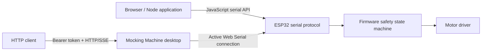

# Mocking Machine APIs

Mocking Machine provides two JavaScript-facing integration layers:

1. The dependency-free serial library for applications that own the ESP32 serial connection.
2. The authenticated desktop HTTP API for applications that share the connection already open in
   the Mocking Machine desktop console.

Both layers use firmware protocol version 1. Motor commands still pass through the firmware safety
state machine. Neither API replaces guarding, a fuse, an emergency stop, or isolation procedures.



## Choosing an API

| Situation | Use |
|---|---|
| Your application opens the ESP32 serial device itself | JavaScript serial API |
| The desktop console already has the serial device open | Desktop HTTP API |
| Browser application using Chrome or Edge | `WebSerialTransport` |
| Node.js application using a serial package | `CallbackTransport` |
| Electron renderer with Web Serial permission | `WebSerialTransport` |
| Python, MATLAB, LabVIEW, another computer, or another process | Desktop HTTP API |

A serial port can normally have only one owner. Do not open it from both the desktop console and
another process. Use the desktop HTTP API when sharing the console's active connection.

## JavaScript serial API

### Installation

From another local Node.js project:

```sh
npm install /path/to/mocking_machine/lib/mocking-machine
```

Import the installed package:

```js
import {
  MessageId,
  MockingMachineClient,
  ParameterId
} from "@modulemore/mocking-machine-api";
```

Inside this repository, browser code can import the source module directly:

```js
import {
  MockingMachineClient,
  WebSerialTransport
} from "./lib/mocking-machine/index.mjs";
```

The package requires Node.js 18 or newer when used from Node. It has no runtime dependencies.

### Browser and Electron example

```js
import {
  MockingMachineClient,
  WebSerialTransport
} from "./lib/mocking-machine/index.mjs";

const machine = new MockingMachineClient({
  transport: new WebSerialTransport({
    baudRate: 115200,
    bufferSize: 4096
  }),
  requestTimeoutMs: 3000
});

machine.on("heartbeat", heartbeat => {
  console.log(heartbeat.buildVersion, heartbeat.state, heartbeat.faults);
});

machine.on("telemetry", telemetry => {
  console.log(telemetry.timestampUs, telemetry.measuredVelocityRadS);
});

machine.on("text", text => console.log("firmware console:", text));
machine.on("protocolError", error => console.warn("serial protocol error", error));

await machine.connect();
const settings = await machine.getSettings();
await machine.startStream();

// Require an explicit safety decision in your application before motor commands.
await machine.arm();
await machine.selectProfile(settings.selectedProfileId);
await machine.startRun();

await machine.stop();
await machine.disconnect();
```

The packaged desktop grants Web Serial permission only to its trusted local renderer. Therefore the
same `WebSerialTransport` works inside that renderer. The current desktop GUI still owns its
connection through its existing protocol path; external applications should use the HTTP API rather
than attempting to open the port again.

### Node serial adapter

The library deliberately does not depend on a specific serial package:

```js
import {
  CallbackTransport,
  MockingMachineClient
} from "@modulemore/mocking-machine-api";
import { SerialPort } from "serialport";

const serialPath = process.env.MOCKING_MACHINE_PORT ?? (
  process.platform === "darwin"
    ? "/dev/cu.usbserial-0001"
    : "/dev/ttyUSB0"
);
const baudRate = Number(process.env.MOCKING_MACHINE_BAUD ?? 115200);

const port = new SerialPort({
  path: serialPath,
  baudRate,
  autoOpen: false
});

const transport = new CallbackTransport({
  open: () => new Promise((resolve, reject) =>
    port.open(error => error ? reject(error) : resolve())),
  write: bytes => new Promise((resolve, reject) => {
    port.write(bytes, error => {
      if (error) return reject(error);
      port.drain(drainError => drainError ? reject(drainError) : resolve());
    });
  }),
  subscribe: (onData, onError) => {
    port.on("data", onData);
    port.on("error", onError);
    return () => {
      port.off("data", onData);
      port.off("error", onError);
    };
  },
  close: () => new Promise((resolve, reject) => {
    if (!port.isOpen) return resolve();
    port.close(error => error ? reject(error) : resolve());
  })
});

const machine = new MockingMachineClient({
  transport,
  requestTimeoutMs: 5000
});

function waitForHeartbeat(timeoutMs = 10_000) {
  return new Promise((resolve, reject) => {
    const timer = setTimeout(() => {
      unsubscribe();
      reject(new Error(`No firmware heartbeat within ${timeoutMs} ms`));
    }, timeoutMs);
    const unsubscribe = machine.on("heartbeat", heartbeat => {
      clearTimeout(timer);
      unsubscribe();
      resolve(heartbeat);
    });
  });
}

try {
  // Opening a USB serial adapter can reset the ESP32. Register before opening,
  // then wait until firmware startup has completed before making requests.
  const ready = waitForHeartbeat();
  await machine.connect();
  await ready;

  const settings = await machine.getSettings();
  await machine.startStream();
  console.log(settings);
} finally {
  await machine.disconnect().catch(() => {});
}
```

`serialport` is illustrative and is not included as a dependency.

Only one process may own the physical serial adapter. Disconnect or quit the Mocking Machine
desktop application before using this direct Node adapter. If the desktop must remain connected,
use the authenticated HTTP API instead.

On macOS, use the outbound `/dev/cu.*` device rather than its `/dev/tty.*` counterpart. The baud
must match the value persisted in the firmware settings; it is not necessarily the default
115200 bit/s. Supported GUI choices are 115200, 230400, 460800, and 921600 bit/s. For example, a
machine configured for 460800 bit/s can be tested with:

```bash
MOCKING_MACHINE_PORT=/dev/cu.usbserial-0001 \
MOCKING_MACHINE_BAUD=460800 \
node test_hw.mjs
```

If `GET_SETTINGS (0x0100)` times out on sequence 1, check serial ownership and baud first. Receiving
bytes without any valid heartbeat or `0xAA55` frame sync strongly indicates a baud mismatch.

### Transport contract

Custom transports implement:

```js
{
  async open() {},       // Optional
  async write(bytes) {}, // Required; bytes is Uint8Array
  async close() {},      // Optional

  // Required. Returns an unsubscribe function.
  on(event, listener) {}
}
```

Transport events are `data`, `error`, and `close`. `StreamTransport` is provided for standard Web
`ReadableStream` and `WritableStream` pairs.

### Client events

| Event | Value |
|---|---|
| `connect` | No value |
| `disconnect` | Optional transport error |
| `message` | Complete decoded message with ID, name, sequence, flags, payload, and data |
| `frame` | CRC-validated raw frame |
| `heartbeat` | Decoded heartbeat data |
| `settings` | Decoded settings data |
| `telemetry` | Decoded telemetry sample |
| `profile_configuration` | Decoded profile |
| `text` | ASCII console text |
| `protocolError` | Framing, CRC, or payload error |
| `transportError` | Serial transport error |

All known device-to-host messages are decoded. Unknown message IDs remain available through
`message` with their raw `Uint8Array` payload.

`u64` and `i64` values, including telemetry timestamps and encoder counts, are returned as `BigInt`
by the serial API to avoid precision loss.

### Configuration methods

| Method | Result |
|---|---|
| `getSettings()` | Current decoded settings |
| `getProfiles()` | Array of stored profiles |
| `getLoadConfiguration()` | Current rotor-load label |
| `getBearingConfiguration()` | Current bearing-condition label |
| `setController({ kp, ki, kd })` | Apply gains to RAM |
| `saveController({ kp, ki, kd })` | Apply and persist gains |
| `setParameter(id, value, { persist })` | Apply one protocol parameter |
| `setProfile(profile, { persist })` | Replace a profile |
| `createProfile(profile, { persist })` | Add a profile |
| `selectProfile(profileId)` | Select for the next run |
| `setDefaultProfile(profileId)` | Persist the default |
| `setLoadConfiguration(configuration)` | Persist rotor-load metadata |
| `setBearingConfiguration(configuration)` | Persist bearing metadata |
| `setDriverDiagnostic(enabled)` | Change EN/DIAG protection |
| `setCurrentSense(enabled)` | Change current protection |

Use exported `ParameterId`, `ProfileKind`, `StopMode`, and other enum objects instead of numeric
literals.

### Machine-control methods

| Method | Description |
|---|---|
| `startStream()` | Synchronize device state and enable telemetry |
| `stopStream()` | Disable telemetry |
| `arm()` | Request the armed state |
| `startRun()` | Start the selected profile |
| `stop()` | Stop and disarm |
| `clearFaults()` | Recheck inputs and clear inactive faults |
| `motorTest(signedRawDuty)` | Send bounded raw-duty test command |
| `startVelocityTest(test)` | Start a temporary velocity step |
| `startVelocitySequence(sequence)` | Start a bounded multi-level test |

The library never writes PWM pins. Firmware validates the current state, active faults, payload
length, values, and configured safety limits before accepting these commands.

### Calibration methods

The client exposes:

- `currentCalibration()` and `requestCurrentCalibrationStatus()`
- `supplyVoltageCalibration()`
- `rotorZeroCalibration()` and `requestRotorZeroCalibrationStatus()`
- `zeroIndexCalibration()` and `requestZeroIndexCalibrationStatus()`
- `startCharacterization()`, `abortCharacterization()`, and `characterizationAction()`

Motor characterization start and abort use the firmware ASCII commands because protocol version 1
does not define binary start/abort message IDs for that workflow.

### Errors and low-level access

Command methods reject with:

- `MachineCommandError` when firmware returns a non-OK result. Inspect `error.result` and
  `error.requestMessageId`.
- `MachineTimeoutError` when no correlated response arrives before the timeout.
- Transport errors from the selected serial adapter.

Low-level APIs are available for extensions:

```js
const sequence = await machine.send(MessageId.GET_SETTINGS);
const response = await machine.request(MessageId.GET_SETTINGS, undefined, {
  responseMessageId: MessageId.SETTINGS,
  timeoutMs: 3000
});
await machine.sendAscii("status");
```

`FrameParser`, `encodeFrame()`, `decodeMessage()`, CRC, and individual payload codecs are also
exported.

## Desktop HTTP API

### Enabling and configuring

Open **Parameters → Desktop application API** in the desktop application.

| Setting | Default | Meaning |
|---|---:|---|
| Enable HTTP API | Off | Starts the server while the desktop application runs |
| Bind IP | `127.0.0.1` | Only clients on the same computer |
| TCP port | `8787` | Listening port, allowed range 1024–65535 |
| Snapshot stream rate | `10 Hz` | Maximum Server-Sent Events publication rate |
| Allow remote control | Off | Enables authenticated POST command endpoints |
| Bearer token | Generated | Required for data and command endpoints |

The configuration is stored in the Electron user-data directory with owner-only file permissions
where supported. The token is generated locally and retained when other settings change.

Selecting `0.0.0.0` listens on all interfaces. Remote clients must use the desktop computer's actual
LAN address, for example `http://192.168.1.20:8787/v1`; `0.0.0.0` itself is not a destination.

The Parameters badges show whether the server is listening, its endpoint, snapshot rate,
read-only/control mode, and whether the GUI currently has a machine connection.

### Authentication

`GET /v1/health` is unauthenticated and contains no settings or telemetry. Every other endpoint
requires either:

```http
Authorization: Bearer YOUR_TOKEN
```

or:

```http
X-API-Key: YOUR_TOKEN
```

The `token` query parameter is also accepted for streaming clients that cannot set headers, but
headers are preferred because URLs are commonly logged.

### Read endpoints

| Method and path | Description |
|---|---|
| `GET /v1/health` | API availability and machine-connected Boolean |
| `GET /v1/status` | Connection, machine state, settings, latest telemetry, update time |
| `GET /v1/settings` | Latest decoded firmware settings |
| `GET /v1/telemetry` | Latest telemetry sample |
| `GET /v1/stream` | Server-Sent Events stream named `snapshot` |

Example:

```sh
curl -H "Authorization: Bearer $MOCKING_MACHINE_TOKEN" \
  http://127.0.0.1:8787/v1/status
```

Telemetry timestamp and encoder-count fields are decimal strings in HTTP JSON so clients in
languages with limited JSON integer precision can decode them safely.

### Streaming

The stream publishes the latest complete snapshot at the configured rate:

```js
const response = await fetch("http://127.0.0.1:8787/v1/stream", {
  headers: {
    Authorization: `Bearer ${token}`
  }
});

const reader = response.body
  .pipeThrough(new TextDecoderStream())
  .getReader();

while (true) {
  const { value, done } = await reader.read();
  if (done) break;
  console.log(value);
}
```

The desktop snapshot rate does not change the firmware telemetry rate. Firmware `streamRate` remains
a machine parameter and is bounded by the configured UART baud rate.

### Command endpoints

Remote control must be enabled explicitly in Parameters. Commands use:

```http
POST /v1/commands/{command}
Content-Type: application/json
Authorization: Bearer YOUR_TOKEN
```

| Command | JSON body | Firmware operation |
|---|---|---|
| `arm` | `{}` | Arm |
| `run` | `{}` or `{ "profileId": 3 }` | Optionally select profile, then start run |
| `stop` | `{}` | Stop and disarm |
| `clear-faults` | `{}` | Recheck and clear inactive faults |
| `select-profile` | `{ "profileId": 3 }` | Select profile for next run |
| `start-stream` | `{}` | Synchronize and enable telemetry |
| `stop-stream` | `{}` | Disable telemetry |

Example:

```sh
curl -X POST \
  -H "Authorization: Bearer $MOCKING_MACHINE_TOKEN" \
  -H "Content-Type: application/json" \
  -d '{"profileId":3}' \
  http://127.0.0.1:8787/v1/commands/run
```

An accepted command returns HTTP 200. A firmware rejection, disconnected machine, unsupported
command, or acknowledgement timeout returns HTTP 409 with an `error` field. Disabled remote control
returns HTTP 403.

Enabling remote control grants software the ability to request motion. Applications should require
their own explicit operator confirmation before Arm or Run and should expose Stop prominently.

## Protocol reference

For exact packet offsets, message IDs, payload sizes, enums, parameter IDs, CRC behavior, and
compatibility rules, see [Serial protocol reference](protocol.md).
