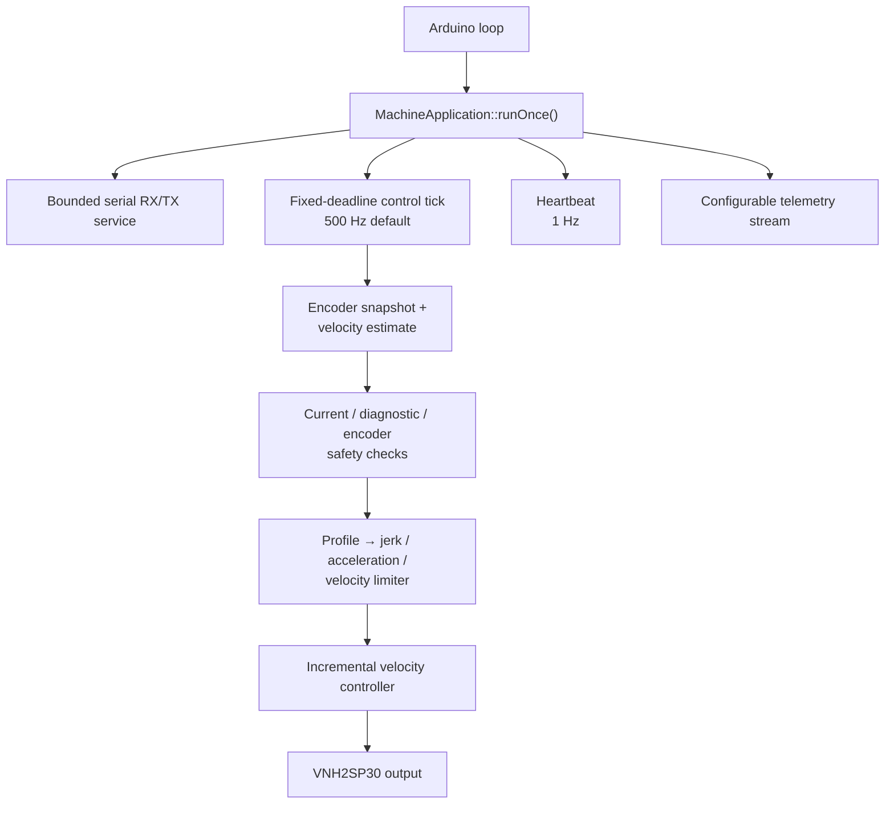
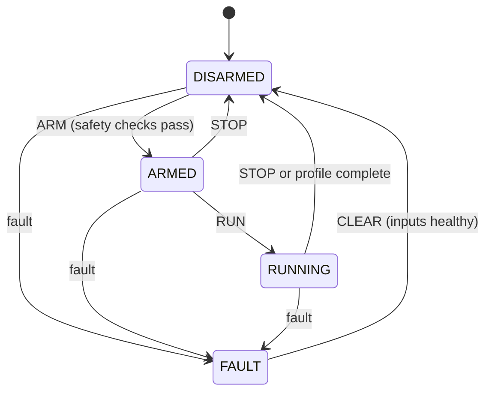

# Product and firmware architecture

## Product definition

Mocking Machine is a controlled excitation rig, not merely a motor speed controller. It creates repeatable, labeled operating conditions so a separate sensing system can learn or validate abnormal-machine signatures. Telemetry currently identifies commanded and measured motion, profile, load-setting ID, encoder/zero-index state, rotor phase, electrical measurements, controller terms, safety state, and faults. Full dataset provenance also requires the firmware build and settings snapshot; the current browser CSV exporter does not yet embed those two records.

The physical machine is intentionally hazardous: a 12 V geared brushed-DC motor can rotate an adjustable imbalance at high speed. A guard, base, fuse, emergency stop, and independent power disconnect are product requirements, not optional accessories.

## Controller design

This project implements the time-correct form:

```text
Δu = Kp Δe + Ki Ts e + Kd Δ²e / Ts
u[k] = saturate(u[k-1] + Δu)
```

Integral contribution that would push a saturated output farther into saturation is rejected. `Kd` defaults to zero, preserving incremental PI behavior.

## Runtime ownership

`MachineApplication` is a Meyers singleton only because Arduino requires global `setup()` and `loop()` entry points. It owns concrete modules, establishes initialization order, and advances the state machine. Modules do not reach back through the singleton and remain independently testable.



Missed control ticks are never replayed against stale sensor data. During active motor output, the scheduler preserves its deadline phase, uses the actual elapsed `dt`, and latches a control-overrun fault when lateness exceeds two periods. While stopped, the same lateness only rephases the next deadline so flash/NVS or host traffic cannot create a retroactive motor fault. Serial parsing and transmission are bounded; no control tick builds a `String`, grows a container, writes NVS, or emits serial output.

## Time and encoder handling

- `esp_timer_get_time()` supplies monotonic 64-bit microseconds.
- Both quadrature channels use CHANGE interrupts and a 16-entry Gray-code transition table.
- The zero-index CHANGE interrupt records both electrical edges and selects complementary
  direction-aware edges for one physical magnet boundary. It rejects same-polarity edges inside
  the configurable debounce interval or before the encoder has travelled the configured fraction
  of a revolution, then atomically stores the direction-corrected timestamp and encoder count.
  Rejected selected edges increment only their diagnostic counter and never increment the accepted
  zero sequence or alter quadrature counting. The first accepted index creates
  the absolute phase reference; subsequent motion comes entirely from encoder-count changes.
  Later index events apply a configurable fraction of the measured phase error to a persistent
  offset, preventing long-term drift without allowing trigger jitter to replace encoder motion.
- Estimator method 0 applies the count-delta low-pass. Method 1 predicts velocity from applied duty
  and a direction-specific characterized motor model, then applies windowed encoder corrections
  with a fixed-size Kalman filter and load-disturbance state. Method 2 estimates acceleration across
  a configurable fixed-capacity circular history of encoder-window velocities, corrects to their
  mean, and extrapolates from the moving-average pairwise acceleration without motor input.
  Encoder edge timestamps remain
  dedicated to the encoder-activity watchdog.
- `counts_per_output_revolution` must include quadrature multiplication and gearbox placement. The default `184` is a placeholder from the mecanum reference and must be measured for this motor.

## Configuration model

`MachineSettings` owns pins, controller gains, encoder scale, direction-aware Hall-index correction and user zero offset, velocity-estimator selection and window length, motion constraints, current and VIN calibration, supply limits, motor characteristics and observer model, profiles, load labels, serial rate, and characterization timing. One schema-versioned NVS blob is protected by CRC16. The current schema is 23. Valid schemas 4–22 are migrated explicitly; invalid CRCs, unsupported layouts, or failed validation fall back to firmware defaults.

Profiles are fixed-capacity structures (8 profiles, 16 waypoints each). Fixed capacity prevents heap fragmentation and makes NVS and protocol limits explicit. All profiles are constrained to one logical direction; `motor_direction` maps that logical direction to electrical polarity.

## Safety state machine



Manual duty expires automatically and runs while the state remains `ARMED`; only profile and velocity tests enter `RUNNING`. Characterization also runs from `ARMED`, requires the literal `CONFIRM_UNLOADED`, tests both directions, pauses before reversal, and measures breakaway duty, maximum velocity, acceleration, and jerk. Breakaway discovery drives raw PWM without deadband compensation. It performs five start-from-rest trials per direction, requires one complete output revolution at unchanged PWM in every trial, and retains the highest successful duty independently for forward and reverse. Full-duty velocity and dynamics discovery also performs five start-from-rest trials per direction, retaining the highest peak velocity, robust acceleration, and robust jerk; the paired motor-model values come from the highest-velocity trial. Completion creates a pending result in RAM. Nothing is persisted until the user explicitly saves it; discard, abort, stop, invalid measurement, or fault retains the previous settings. Current sense and DIAG are secondary protection; the physical fuse and emergency stop remain primary.

Saving a characterization result also applies a conservative velocity constraint: `vmax` can
only decrease to the lower measured forward/reverse maximum, never increase. During each
full-duty direction, an allocation-free online estimator filters the 500 Hz velocity derivative
and tracks configurable robust quantiles for acceleration and jerk. In parallel, bounded least
squares identifies the direction-specific first-order velocity gain and time constant used by the
Kalman observer. The browser shows the
weaker-direction recommendations with a configurable safety factor; applying either limit is
explicitly opt-in and can only lower the existing value. Stored velocity profiles and the
encoder-timeout threshold are clamped in the same candidate settings copy, waypoint slopes are
constrained when acceleration is selected, then the whole structure is validated before a
single Preferences write.

## Browser console

The dependency-free console targets a rectangular desktop browser around 1440×900 at desk distance, English/LTR, keyboard and pointer. It uses a compact 1.125 type scale, persistent connection/machine/fault state, visible focus, reduced-motion support, actuator confirmation dialogs, live response charts, settings table, profile editor, tuning controls, terminal, calibration, and CSV export. Editable machine parameters can be exported as deterministic `parameter,value` CSV and imported through a changed-values review. Import validates locally, disarms if necessary, then persists one row at a time through the firmware-validated `SET_PARAMETER` path and stops at the first rejection. A low-profile two-row badge beside the navigation tabs shows link state, RX/TX byte rates, telemetry rate, and estimated dropout count. Activating the keyboard- and pointer-operable badge opens the full valid-frame/command rates, telemetry age and loss percentage, and CRC/framing totals. The desktop Overview places six live machine metrics in a 2×3 block beside the larger rotor-load setup, then stacks these groups on narrower screens. The Machine state metric is the keyboard- and pointer-operable arm/disarm control: green DISARMED requires the standard safety confirmation before arming, while red ARMED or RUNNING immediately invokes the normal stop/disarm path. Text and `aria-pressed` state accompany color. The Driver VIN and Motor current metrics each include a four-second, auto-scaled telemetry sparkline beneath the numeric value while retaining the same metric-card dimensions; both canvases carry continuously updated text alternatives. Its keyboard-operable 12-slot rotor diagram uses color, a strength badge, and an inward arrow to label the physical imbalance setup without implying remote actuation. Beside it, an inline bearing SVG toggles between labelled good and broken states; a disarmed click persists immediately through its own bounded protocol message while sharing the rotor setup ID. Encoder CPR calibration is host-guided: telemetry supplies the 64-bit start/end counts, the browser averages their absolute difference over 1–10 manually entered output-shaft turns, and an explicit review action saves the rounded integer through the normal disarmed `SET_PARAMETER` path. Rotor-zero calibration captures and persists one integer wrapped encoder-tick difference from the last accepted index. Each later index filters the corrected wrapped tick toward that reference; conversion to degrees is output-only. Current calibration uses two non-blocking 64-sample captures and requires explicit review before saving.

Run recording begins only after a successful `START_RUN`, `START_VELOCITY_TEST`, or `START_VELOCITY_SEQUENCE` ACK and the first telemetry sample in `RUNNING`. The repeated manual test previews 2–16 deterministic random velocity levels in the browser, sends the fixed 72-byte sequence only after the normal stop/disarm/arm confirmation chain, and executes it from allocation-free firmware storage. It stops when state leaves `RUNNING`, retains at most 12,000 samples, snapshots bearing condition with the rotor setup, and writes `bearing_condition` into every telemetry CSV row. A separate load CSV is exported when the recorded run had configured loads and retains its load-only columns. The exporter does not currently include heartbeat build metadata or a settings snapshot.

Connecting automatically starts only the telemetry stream. It never arms or starts the motor.

## Remaining validation and product work

1. Confirm encoder CPR, gearbox ratio, motor stall current, exact WROVER board variant, and protected EN/DIAG voltage on the assembled machine.
2. Move parameter names, descriptions, ranges, and defaults from the browser-maintained table into firmware-owned descriptors.
3. Add named collections of reusable load configurations; firmware currently stores one active 12-slot setup.
4. Add automatic zero-current offset capture and direction-specific current-sense characterization; the current GUI implements a general two-point linear calibration.
5. Add firmware-side UART transmit-drop/backpressure counters (the browser currently provides only host-observed rates and timestamp-gap loss estimates) and include heartbeat build plus settings metadata in each exported run.
6. Validate low-speed quantization, controller gains, acceleration/jerk recommendations, and safety thresholds on a dynamometer before operating with imbalance.
