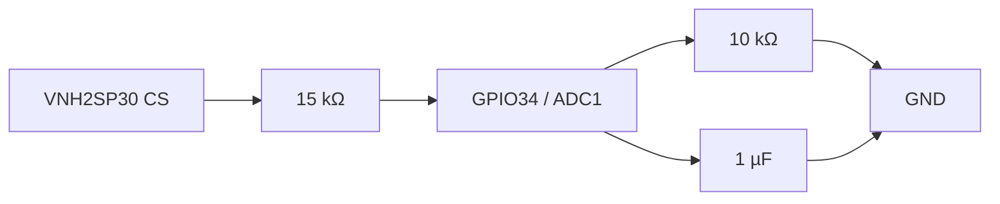
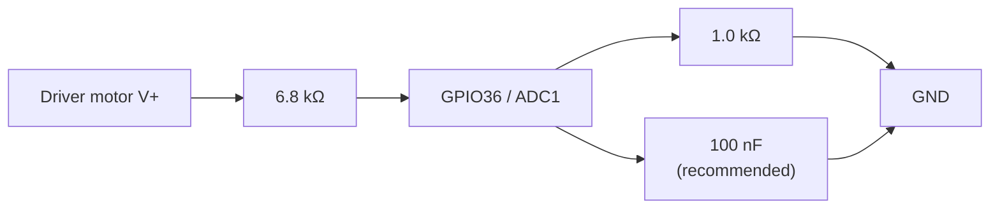

# Wiring and commissioning

## Default signal map

| Function | ESP32 GPIO | Module signal | Notes |
|---|---:|---|---|
| Encoder A | 32 | Encoder A | Interrupt input; no boot-strapping conflict |
| Encoder B | 33 | Encoder B | Interrupt input; no boot-strapping conflict |
| Zero-index IR sensor | 13 | Sensor digital output | Rising-edge interrupt; 3.3 V only |
| Motor direction A | 25 | INA | Prefer a 74AHCT125 level buffer |
| Motor direction B | 26 | INB | Prefer a 74AHCT125 level buffer |
| Motor PWM | 27 | PWM | 20 kHz, 11-bit LEDC; prefer a 74AHCT125 buffer |
| Current sense | 34 | CS | ADC1 input-only, external divider/filter required |
| Driver diagnostic | 35 | EN/DIAG | Optional and disabled by default; external 5 V-to-3.3 V protection required when enabled |
| Driver VIN sense | 36 | Motor supply V+ through divider | ADC1 input-only; 6.8 kΩ / 1 kΩ divider |

All pins live in `MachineSettings`, but the current serial parameter API does not expose pin changes. Changing this map requires a firmware-default change (or a compatible persisted-settings migration) and rebuild.

The zero-index input accepts the first rising edge as the rotor reference and captures both
its microsecond timestamp and the current quadrature count. Later rising edges inside
`zero_index_min_interval_us` (5,000 µs by default) are treated as sensor bounce. This filter
does not reset, suppress, or otherwise modify the GPIO32/33 encoder count. At the configured
150 rad/s maximum, one revolution is about 41.9 ms, so the 5 ms default remains comfortably
below the expected one-pulse-per-revolution interval.

After the first reference, another zero edge is accepted only after both the 5 ms debounce and
the default 0.50-revolution encoder separation have elapsed. This rejects a long/noisy optical
pulse even when another rising edge occurs after the time-only debounce. Rejected edges appear
only in the rejected-edge diagnostic count; they never advance the accepted zero number.

The default `zero_index_correction_gain` of 0.10 applies only 10%
of each measured index phase error. Encoder counts therefore control short-term position and
the optical index removes drift gradually. Increase the gain only when missed encoder counts
are confirmed; high gain also transfers more optical-trigger jitter into the reported angle.

## Power wiring

1. Connect the 12 V supply through an appropriately rated fuse and a latching emergency-stop/power contactor to module motor `V+`.
2. Connect supply negative, driver ground, ESP32 ground, encoder ground, and sensor ground at a deliberate common/star point.
3. Power the ESP32 and driver logic from a regulated supply. Do not power the motor from the ESP32 board.
4. Connect motor leads to OUTA/OUTB. Use `motor_direction` to define logical forward; do not infer physical direction from wire color.
5. Fit bulk electrolytic capacitance near the driver plus local ceramic bypassing. Keep the high-current motor loop short and separate from encoder/sense wiring.
6. Use twisted/shielded encoder wiring and keep it away from motor leads. Ground the shield at one end.

The module vendor rates motor power at 5.5–16 V and reports roughly 6 A without additional heat sinking, with higher sustained current requiring proper thermal design. Size wiring, fuse, connector, and emergency stop from measured motor stall current and the weakest component—not the advertised 30 A peak.

## Logic-level protection

The VNH2SP30 input-high minimum is close to a 3.3 V ESP32 output, leaving little noise margin. Use a 5 V-powered 74AHCT125 (or equivalent unidirectional logic buffer with 3.3 V-compatible inputs) for INA, INB, and PWM.

The module documentation says its EN/DIAG lines are pulled up by the board's 5 V logic supply. Do not connect a 5 V-pulled diagnostic signal directly to an ESP32 pin. Use a resistor divider, open-drain level shifter, or suitable buffer. GPIO35 has no internal pull resistor.

Firmware leaves driver diagnostic monitoring disabled by default, so EN/DIAG may remain disconnected without producing a floating-input fault. Enable it from the Parameters page or with `diagnostic on` only after the protected signal has been verified. `diagnostic off` remains available if an active diagnostic fault caused lockout.

## Current sense

CS can approach the module logic rail and is noisy under PWM. A practical starting network is:

This scales 5 V to about 2 V and low-pass filters PWM ripple. The default firmware gain is only a starting estimate for that divider. The browser **Calibration** page performs two non-blocking 64-sample captures, calculates gain and offset, and presents the candidate before saving. The ASCII `current calibrate <A>` command remains a simpler one-point gain calibration. The vendor notes approximately 10% sense accuracy, poorer low-current performance, direction-dependent variation, and a need for more filtering than the module's small capacitor. Do not use CS as the sole short-circuit protection.

Current-sense fault protection is disabled by default because an unconnected or uncalibrated GPIO34 can produce false trips. ADC telemetry remains available. Enable protection from Parameters or with `current protection on` only after verifying the circuit; use `current protection off` to disable it again.

## Driver VIN measurement

Connect the divider to GPIO36:

The nominal divider gain is `7.8`; 16 V at the driver becomes approximately 2.05 V at GPIO36. Use stable 1% resistors at minimum, or 0.1% parts when repeatability across temperature matters. The browser VIN calibration dialog averages 64 ADC readings and recalculates the actual gain from a trusted multimeter value. Firmware then applies configurable 5.5 V undervoltage and 16.0 V overvoltage limits. These software limits do not replace supply transient protection.

Firmware rejects VIN calibration when the ADC input is above 2.8 V because that region is near saturation and cannot produce a trustworthy divider calibration. At a 12 V driver supply, measure approximately 1.54 V at GPIO36 before calibrating.

## Commissioning order

1. Test firmware and serial with motor power disconnected.
2. With the motor disarmed, use **Calibration → Output-shaft encoder calibration**. Mark the
   output shaft, capture the start count, rotate it 5–10 complete turns, and stop at the same
   mark. Review the signed count change, measured counts/revolution, rounded firmware value,
   and percentage change before saving. The displayed count includes all decoded quadrature
   edges, so it may be four times a single-channel pulse or magnetic pole-cycle specification.
   Direction is intentionally not changed by this calibration.
3. Verify zero-index timestamp/count by turning slowly by hand. Then move the rotor to the desired
   physical 0° point and use **Calibration → Rotor position zero**. Hold it still while firmware
   captures the integer wrapped encoder-tick difference from the accepted index, review the
   candidate tick offset, and save it. Degrees are calculated only for display after correction.
4. Verify INA/INB/PWM and DIAG levels with a scope or logic analyzer.
5. Calibrate GPIO36 VIN against a multimeter, then use the two-point current calibration with a current-limited bench supply and trusted ammeter.
6. Secure the unloaded motor in the final guard and start **Calibration → Motor characterization**. The equivalent terminal sequence is `arm` followed by `characterize start CONFIRM_UNLOADED`.
7. Tune at low maximum duty and acceleration.
8. Add a small imbalance only after unloaded behavior, emergency stop, enclosure, and mounting are validated.

# GX16 Harness

## Signal + 3.3v for motor and encoder stuff

gx16 cable 6P

| female pin | male panel plug | carry | 
|---|---|---|
| black + gray | 1 | GND |
| green | 2 | Encoder C1 |
| yellow | 3 | zero trigger DOUT |
| blue | 4 | Encoder C2 |
| red + orange | 5 | Encoder + zero trigger  3.3V |
| NC | 6 | NC |

## Motor 

| female pin |  carry |
|---|---|
| red + yellow | M+ |
| black +  green | M- |
